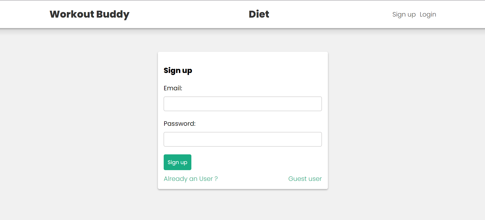
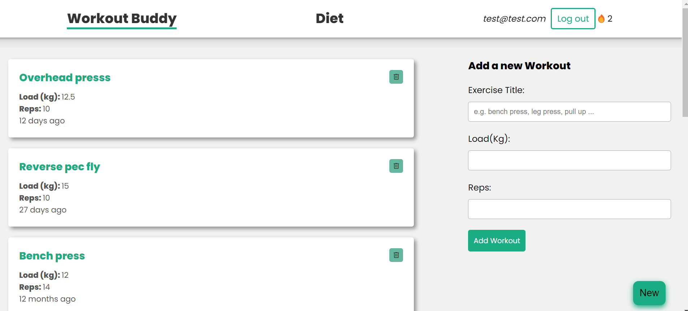

### Workout Buddy: A Workout Tracking app

## Overview
A full-stack web application built using the MERN stack (MongoDB, Express.js, React.js, Node.js) with authentication. It allows users to track their workouts and diets efficiently, providing features for creating, deleting, and viewing workout routines.

TODO: Graph to display progress 

## Features

- **User Authentication**: Secure user registration and login using JWT (JSON Web Tokens).
- **Workout Tracking**: Create and manage workout routines, log exercises, and track progress over time.
- **Diet Tracking**: Record daily meals, calorie intake, and nutritional information.
- **Streak** : Keep Track of workout Streak
- **Responsive Design**: Mobile-friendly interface for easy access on any device.
- **Guest User**: Can login as guest user

## Tech Stack

- **Frontend**: React.js with Context API and Reducer hook for state management and styled with CSS and Framer Motion.
- **Backend**: Node.js with Express.js for RESTful APIs and MongoDB for data storage.
- **Authentication**: JWT (JSON Web Tokens) for secure user authentication.
- **Deployment**: Deployed on Vercel, with MongoDB Atlas for cloud database hosting.

